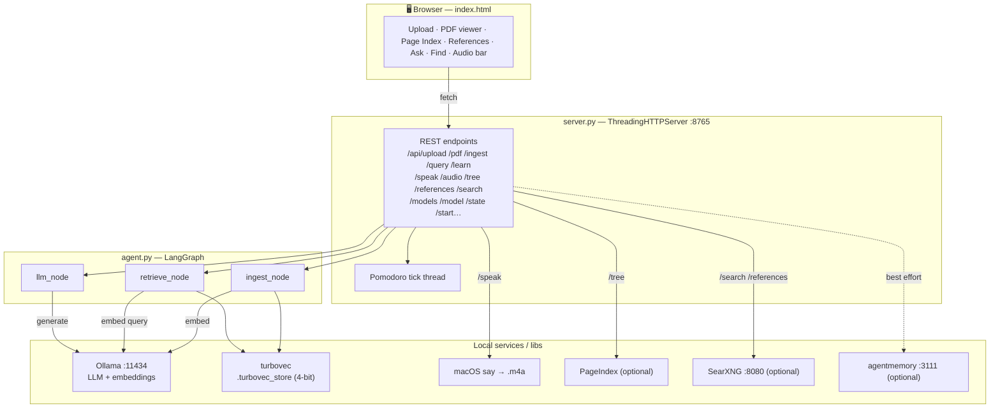
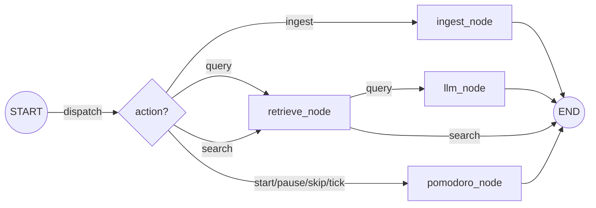
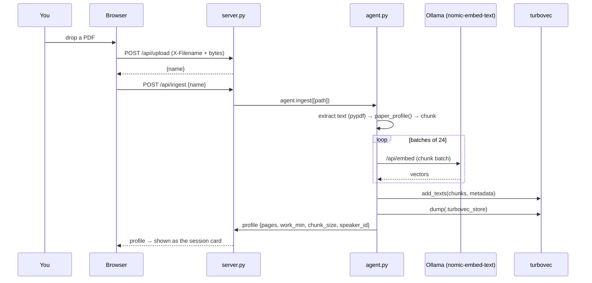
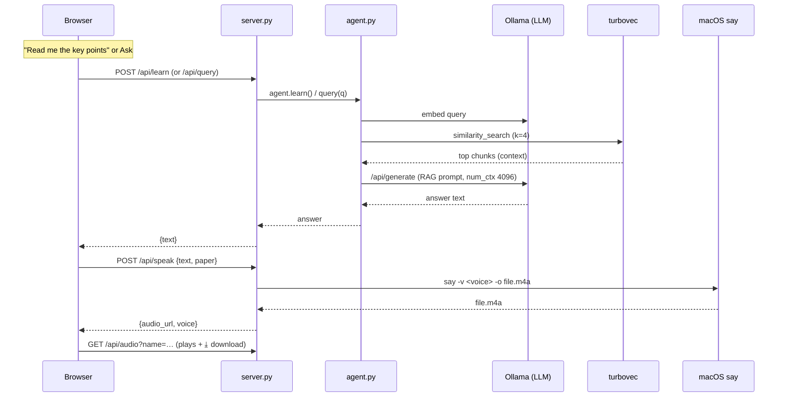

# Research Agent — How It Works (and where it might break)

This document explains the whole system end‑to‑end with diagrams, then gives an
**honest audit** of the weak spots so you know what to trust and what to watch.

> TL;DR of the architecture: a tiny Python HTTP server ([server.py](server.py))
> serves a single‑page UI ([index.html](index.html)) and exposes REST endpoints.
> Heavy work is done by a LangGraph agent ([agent.py](agent.py)) that talks to
> **Ollama** (LLM + embeddings) and **turbovec** (quantized vector store).
> Audio is made with macOS `say` ([tts.py](tts.py)). PageIndex / SearXNG /
> agentmemory are optional add‑ons.

---

## 1. System map



---

## 2. The agent graph (LangGraph)

`agent.py` builds one small state graph. Each REST call enters at `START`, is
routed by `action`, and exits at `END`.



- **ingest** → extract text → chunk → embed → store in turbovec → set timer.
- **query** → retrieve top‑k chunks → LLM answers (RAG).
- **search** → retrieve only (raw chunks, no LLM).
- **pomodoro** → timer transitions (the live timer actually runs in the server
  thread; this node exists for completeness).

> Note: the **VITS** node was removed from the active path. Audio now comes from
> macOS `say`, so the agent never needs `torch`.

---

## 3. Main flow A — Upload & ingest a paper



What you get: embeddings stored, the Pomodoro timer resized to the paper, and a
profile card. No audio yet — that's on demand.

---

## 4. Main flow B — Ask / Post‑mortem (RAG + audio)



The voice is chosen deterministically from the paper name, so each paper keeps a
consistent narrator. If `say` ever fails, the browser's built‑in voice speaks it
(no saved file in that case).

---

## 5. Adaptive profile (per paper)

`paper_profile(filename, total_chars, n_pages)` derives three things from size:

| Output | Rule | Why |
|---|---|---|
| `chunk_size` / `overlap` | 1800/200 (small) → 850/100 (thesis) | Coarse chunks = fewer vectors = lighter on a 16 GB Mac |
| `work_seconds` | `clamp(pages × 2 min, 15, 50)` | Pomodoro scales to reading load |
| `speaker_id` | `md5(filename) % 21` | Stable per‑paper identity |

---

## 6. Component cheat‑sheet

| File | Role | Talks to |
|---|---|---|
| [server.py](server.py) | HTTP server, REST, timer, file serving | agent, tts, pageindex, searxng, memory |
| [agent.py](agent.py) | LangGraph: ingest / retrieve / llm; Ollama client | Ollama, turbovec |
| [tts.py](tts.py) | macOS `say` → `.m4a`, per‑paper voice | macOS `say` |
| [index.html](index.html) | the whole UI | server REST |
| [references.py](references.py) | extract bibliography → find & download | Ollama, SearXNG |
| [pageindex_tree.py](pageindex_tree.py) | section tree (optional) | PageIndex → Ollama |
| [searxng_client.py](searxng_client.py) | web/reference search | SearXNG |
| [memory_client.py](memory_client.py) | research memory (best‑effort) | agentmemory |

---

## 7. Where the issues are (honest audit) ⚠️

Ordered roughly by how likely they are to bite you.

### 🔴 High — correctness

1. **One shared vector store for ALL papers.**
   Every ingested paper goes into the same `.turbovec_store`. `retrieve_node`
   searches the *whole* store with no per‑paper filter, so when you've ingested
   several papers, **Ask can pull context from the wrong paper.**
   *Fix:* tag chunks with the paper name (already in metadata) and filter the
   search by the current paper, or use one store per paper.

2. **Re‑ingesting the same paper duplicates it.**
   `add_texts` is called without stable ids, so uploading the same PDF twice adds
   a second full copy of its chunks — inflating the store and skewing retrieval.
   *Fix:* derive deterministic ids from `(paper, chunk_index)` so re‑ingest
   upserts instead of appends.

3. **4‑bit quantized recall is approximate.**
   turbovec stores vectors at 4‑bit; similarity is close but not exact. Fine for
   "find relevant passages", not for anything needing exact nearest neighbours.

### 🟠 Medium — reliability

4. **Reference extraction is heuristic.**
   It finds the "References" heading by regex, falls back to the last 25% of the
   text, and asks the LLM for JSON. A **small model** (e.g. llama3.2:3b) often
   returns messy/partial JSON, and scanned PDFs with no text layer yield nothing.

5. **Reference download only handles a few hosts.**
   `searxng_client` turns arXiv/bioRxiv/medRxiv/direct‑PDF links into downloads;
   everything else returns "no PDF". SearXNG must be running **and** have the JSON
   format enabled, or `/search` errors.

6. **First request after a model switch is slow.**
   Ollama loads the model on first use; a cold `gemma4:e4b` (9.6 GB) can take many
   seconds and may look like a hang. `keep_alive=5m` then unloads it when idle, so
   the *next* cold call pays again.

7. **`set_model` is global, not per‑request.**
   Switching the model in the UI changes it for everyone/every tab. Fine for
   single‑user local use; surprising if shared.

### 🟡 Low — polish / portability

8. **`speaker_id` mismatch.** The profile's `speaker_id` (0–20, a VITS leftover)
   is *not* what `tts.py` uses — `say` picks its voice by hashing the paper name
   into its own list. Harmless, but the number shown isn't the voice you hear.

9. **macOS‑only audio.** `tts.py` uses `say`; on Linux/Windows it falls back to
   the browser voice (no saved file).

10. **PageIndex is heavy and optional.** Needs `litellm` + `pymupdf` + `PyPDF2`,
    and makes a per‑section LLM call (slow). Not needed for the core flow.

11. **Tracebacks returned to the client.** `_fail` sends the full stack trace in
    JSON. Convenient for debugging, but it's an info leak if the server were ever
    exposed beyond localhost (it binds `0.0.0.0`, no auth).

12. **Whole‑PDF text held in memory during ingest.** Embeddings are batched, but
    the full extracted text is loaded first — a very large book could spike RAM.

13. **agentmemory is barely wired in.** It's best‑effort logging; nothing in the
    main flow reads it back, so it adds little today.

14. **No streaming.** Long answers block until complete; the UI shows a spinner
    rather than tokens as they arrive.

---

## 8. Quick "is it healthy?" checklist

```bash
# right venv (the #1 past gotcha)
which python                       # → research_agent/.venv/bin/python

# services
curl -s localhost:11434/api/tags | head -c 80   # Ollama up?
curl -s localhost:8080/healthz                  # SearXNG up? (optional)

# models present
ollama list                        # gemma4:e4b / llama3.2:3b + nomic-embed-text

# agent imports without torch
.venv/bin/python -c "import agent; print('ok', agent.get_model())"
```

---

## 9. If I had time for three fixes

1. **Per‑paper retrieval** (issue #1) — biggest correctness win.
2. **Deterministic chunk ids** (issue #2) — stops silent duplication.
3. **Stream LLM answers** (issue #14) — the app would *feel* far faster, which is
   likely the "it took too much time" complaint.
